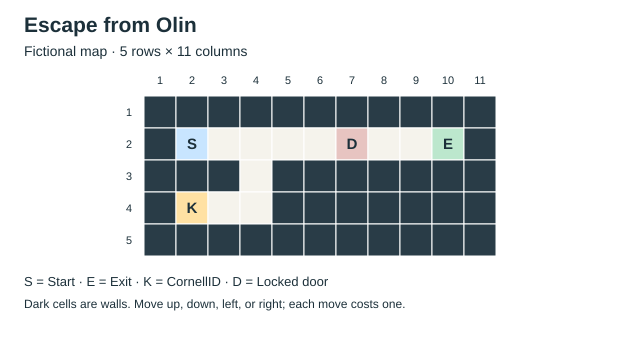

# PS2: Escape from Olin — The Missing Keycard

Problem set 2 connects the stacks and queues from Week 3 with the graph searches
from Week 4. You will turn a maze into a graph, use a queue to find a shortest
escape route, and change the definition of a search state when a locked door
makes your available moves depend on whether you have collected a keycard.

## Logistics

- **Dates:** Released Saturday, September 19, 2026. Submit a ZIP archive to
  Canvas by **11:59 PM ET on Saturday, October 3, 2026**.
- **Infinite-revision policy:** You must submit something by the initial
  deadline to participate. After that deadline, eligible students may revise
  and resubmit until the end of the semester; the highest score is retained.
  No initial submission means a score of `0` and no access to later revisions.
- **Reference solution:** The reference solution will be released after the
  initial deadline. You may consult it to understand mistakes and debug your
  work, but you may not copy it. Copying the reference solution results in a
  score of `0` for this assignment.
- **Group and AI policy:** Submit independent work. You may discuss ideas with
  classmates but may not share code or solutions directly. You may use Julia
  documentation, AI tools, and internet resources. You are responsible for
  understanding and explaining your submitted implementation.
- **Grading:** The maximum score is `4`; see the
  [grading rubric](RUBRIC.md) for the public checks and completion requirements.

## Getting started

This assignment is supported with Julia `1.12.7` and uses only standard
libraries. There are no external packages to install and no dependency on your
PS1 solution or the course repository.

1. Download the `Source code (zip)` archive from the tagged
   [PS2 GitHub release](https://github.com/varnerlab/PS2-CHEME-4800-5800-Fall-2026/releases/tag/ps2-cheme-4800-5800-2026.1)
   and extract it completely.
2. Open the extracted folder in VS Code. Open a terminal in the folder
   containing this file and [`check_submission.jl`](check_submission.jl).
3. Complete the four functions in [`src/Compute.jl`](src/Compute.jl). Keep any
   additional solution helpers inside [`src`](src) and load them from that file.
4. Answer the three questions in [`responses.md`](responses.md).
5. Run the public checks as you work:

   ```bash
   julia --startup-file=no check_submission.jl
   ```

The starter functions intentionally raise errors. The checks are expected to
fail until you implement them. Do not edit the tests,
[`test_support.jl`](test_support.jl), the checker, or the map files to make an
incomplete solution appear to pass.

## The story

It is late in Olin, and you are ready to go home. The building
directory has been replaced by a text file. Can you write a program to turn that file
into a route to the exit?

The first map contains only walls and open corridors. The second introduces a
locked door, and the keycard is in a side room. Finding the card may require
walking away from the exit and returning through a corridor you have already
visited. These maps are fictional puzzles, not actual floor plans of Olin Hall.



## Reading the map

Each line of a map file is one row. All rows have the same number of characters.
The supplied [map reader](src/Files.jl) returns a
[`MyMazeModel`](src/Types.jl) with a character matrix `cells` and two positions,
`start` and `goal`.

| Symbol | Meaning | Movement rule |
|:---:|---|---|
| `#` | Wall | You cannot enter this cell. |
| `.` | Open floor | You may enter this cell. |
| `S` | Start | Begin here; you may return later. |
| `E` | Exit | The route ends when you reach this cell. |
| `K` | Keycard | Entering this cell automatically collects the card. |
| `D` | Locked door | You may enter only if you already have the card. |

A position is `(row, column)`, using Julia's one-based indices. Row numbers
increase downward; column numbers increase to the right. For example, `(2, 4)`
means row 2, column 4, and its symbol is `maze.cells[2, 4]`.

You may move one cell **up, down, left, or right**. Diagonal moves, moves through
walls, and moves outside the map are forbidden. Each legal move costs one.
The objective is to minimize the number of moves, not the number of distinct
physical cells visited. Waiting in place is not a move.

Every map has exactly one `S` and one `E`. The reader allows at most one `K`
and any number of `D` cells. It checks the file format, but it does not promise
that an escape route exists. Borders need not consist of walls, so your code
must check array bounds explicitly.

The model types, map construction, file loading, queue, and drawing functions
are supplied. Leave the input maze unchanged throughout a search: record
discoveries and card possession in separate collections.

## Part 1: Find the shortest escape route

In this part, your maps contain only `#`, `.`, `S`, and `E`. Represent each
non-wall position as a graph vertex and each legal move as an edge. You do not
need to construct or store every edge before searching; compute the neighbors
of a position when the search reaches it.

For example, [`data/test_part_1.txt`](data/test_part_1.txt) contains:

```text
#########
#S..#..E#
#.#.#.#.#
#.......#
#########
```

The start is `(2, 2)` and the exit is `(2, 8)`. The wall between them prevents
a straight walk across row 2. A shortest escape takes **10 moves** and contains
**11 positions**, including the start and exit.

Complete two functions in [`src/Compute.jl`](src/Compute.jl):

1. **The `neighbors(maze, position)` function** returns a `Vector{Position}`
   containing the in-bounds, non-wall cells one orthogonal move from `position`.
   Return each neighbor once, in any order. Return an empty vector when no move
   is possible. Throw a descriptive `ArgumentError` if the given position is
   outside the map or is itself a wall.

   This function checks geometry only. Treat `K` and `D` as non-wall cells too;
   Part 2 will decide which geometrically possible moves are legal.

2. **The `escape_part_1(maze)` function** uses breadth-first search to return a
   shortest route as a `Vector{Position}`. Include the start and exit, in travel
   order. Return `nothing` if the exit is unreachable. Throw a descriptive
   `ArgumentError` if the map contains any `K` or `D` cell, because those symbols
   require Part 2's state representation.

Use the supplied [`MyQueue`](src/Queue.jl) interface to manage the search
frontier. Its operations are the same as in the Week 3 lecture:

```julia
queue = MyQueue{Position}();
push!(queue, maze.start); # append to the back
position = popfirst!(queue); # remove from the front
```

Use `isempty(queue)` before removing an item. The queue's fields are internal;
use its public operations rather than accessing its storage directly.

Your search needs a record of discovered positions and predecessor links.
Mark a position as discovered when you add it to the queue, so two different
parents cannot enqueue the same position. When you find the exit, follow the
predecessors back to the start and reverse that sequence. A traversal order is
not an escape route: consecutive entries in the returned route must be joined
by legal moves.

Run the Part 1 checks with:

```bash
julia --startup-file=no testme_part_1.jl
```

The larger [`data/production_part_1.txt`](data/production_part_1.txt) map has a
minimum escape length of **84 moves**. The tests accept any route achieving
the minimum; they do not prescribe a neighbor ordering or a particular route.

## Part 2: Collect the missing keycard

In this part, a map may also contain `K` and `D`. Start without the card.
Collecting it is automatic when you enter `K`, costs no extra move, and lasts
for the rest of the route. The card is reusable and opens every door in the
map. Traversing an unlocked door costs one move, just like entering a floor
cell. You do not need to collect the card when an escape route avoids all doors.

The small map in [`data/test_part_2.txt`](data/test_part_2.txt) is:

```text
###########
#S....D..E#
###.#######
#K..#######
###########
```

The keycard is at `(4, 2)`. To collect it, you must leave the main corridor at
`(2, 4)`, visit the side room, and return to that same junction. A shortest
escape takes **16 moves**.

> **What identifies a search state?**
>
> In Part 1, your location determines all possible next moves. In Part 2, door
> access also depends on whether you carry the keycard. Use
> `(row, column, has_keycard)` as the graph vertex, where `has_keycard` is a
> Boolean value. The states `(2, 4, false)` and `(2, 4, true)` describe the same
> physical junction with different access to the rest of the map. Your queue,
> discovered set, and predecessor dictionary must distinguish those states.

The supplied alias `EscapeState` names the tuple type `Tuple{Int, Int, Bool}`.
States describe your situation **after entering the cell**, so any state on
`K` must already carry the card. Do not erase `K` or change `D` in the map;
the state records their effect on a particular route.

Complete the remaining functions in [`src/Compute.jl`](src/Compute.jl):

1. **The `nextstates(maze, state)` function** returns a `Vector{EscapeState}`
   containing every distinct legal state after one move, in any order. Use
   `neighbors` for geometric candidates, reject entry to a door without the
   card, and update card possession when entering `K`. Once true, the flag
   remains true.

   Throw `ArgumentError` if the current position is outside the map or is a
   wall, or if the current cell is `K` or `D` while the flag is `false`. You
   only need to check this local validity; you need not prove that a supplied
   state could actually be reached from `S`.

2. **The `escape_part_2(maze)` function** uses breadth-first search over full
   states and returns a shortest route as a `Vector{EscapeState}`. Begin with
   `(maze.start[1], maze.start[2], false)` and end at the exit with either flag.
   Use `MyQueue{EscapeState}` and `nextstates`. Return `nothing` when the exit
   is unreachable, including when the only keycard is behind a required locked
   door. This function must also handle ordinary maps without a key or door.

You may reuse private search or route-reconstruction helpers between the two
parts. The two public functions must retain their documented input and output
contracts. A route may revisit a physical position with a different card flag;
that does not repeat a vertex in the state graph.

Run the Part 2 checks with:

```bash
julia --startup-file=no testme_part_2.jl
```

The larger [`data/production_part_2.txt`](data/production_part_2.txt) map requires
**178 moves** for a shortest escape. As in Part 1, checks validate the entire
returned route, its endpoints, its legal moves, and its minimum length.

## Display your escape route

The supplied [`runmaze.jl`](runmaze.jl) script prints your route and saves an SVG
map. After completing the relevant solver, run:

```bash
julia --startup-file=no runmaze.jl 1 data/test_part_1.txt
julia --startup-file=no runmaze.jl 2 data/test_part_2.txt
```

Open the generated SVG file in the `outputs` folder with a browser. Blue lines
show travel without the card; orange lines show travel while carrying it.
The text view marks visited floor cells with `*`. Repeated visits can overlap
in a picture, so use the printed state sequence to inspect their exact order.
The renderer draws the route you supply; it does not establish that the route
is legal or shortest. No screenshots or drawings are required for submission.

To inspect a map before implementing the solvers, use the Julia REPL:

```julia
include("Include.jl");
maze = readmaze("data/test_part_2.txt");
println(rendermaze(maze));
savemaze(maze, "outputs/keycard-map.svg");
```

Restart Julia after editing source files before rerunning REPL examples. Each
command-line test invocation starts a fresh Julia process automatically.

## Explain your choices

Complete the three prompts in [`responses.md`](responses.md). A short paragraph
per question is enough. Explain why the state must include card possession,
why the queue finds a route with the fewest moves, and how many states the
search might discover. These explanations are part of the completion review;
the checker does not grade them automatically.

## Checking and submitting your work

Run [`check_submission.jl`](check_submission.jl) from the problem-set folder:

```bash
julia --startup-file=no check_submission.jl
```

The checker runs all **48 public checks** and writes `MANIFEST.txt` containing
test outcomes and SHA-256 digests of your source files and written responses.
**It does not connect to Canvas or upload your work.** Passing all public checks
leaves the final score pending the completion review in [RUBRIC.md](RUBRIC.md).

Zip the entire problem-set folder, including your source files, maps,
[`responses.md`](responses.md), and the generated `MANIFEST.txt`. Rename it
`CHEME-4800-5800-PS2-<your netid>.zip`, replacing the complete placeholder,
including angle brackets, with your NetID. For example, `abc123` submits
`CHEME-4800-5800-PS2-abc123.zip`. Upload it to the PS2 Canvas assignment.

If you cannot resolve every failure by the deadline, submit your current work
anyway. Partial solutions earn partial credit, and an initial submission is
required for the infinite-revision policy.
